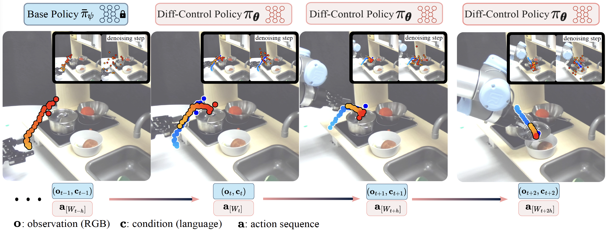

# α-MDF: An Attention-based Multimodal Differentiable Filter for Robot State Estimation
This repo is the official implementation of ["Diff-Control: A Stateful Diffusion-based Policy for Imitation Learning"](https://diff-control.github.io/static/videos/Diff-Control.pdf) by Xiao Liu, Yifan Zhou, Fabian Weigend, Shubham Sonawani, Shuhei Ikemoto, and Heni Ben Amor. The project website is [here](https://diff-control.github.io/).
<p align="center">

</p>

While imitation learning provides a simple and effective framework for policy learning, acquiring consistent action during robot execution remains a challenging task. Existing approaches primarily focus on either modifying the action representation at data curation stage or altering the model itself, both of which do not fully address the scalability of consistent action generation. To overcome this limitation, we propose the Diff-Control policy, which leverages a diffusion-based model to learn action representation from a state-space modeling perspective. This statefulness is achieved through a Bayesian formulation, instead of the naive fusion of stateful features. Our experimental results demonstrate the significance of incorporating action statefulness in policy learning, where Diff-Control shows improved performance across various tasks. Specifically, Diff-Control achieves an average success rate of 72% and 84% on stateful and dynamic tasks, respectively. Notably, Diff-Control also shows consistent performance in the presence of perturbations, outperforming other state-of-the-art methods that falter under similar conditions.
<p align="center">

</p>

1. Add Bayesian guarantee for diffusion-based polices using ControlNet structure as a transition model to ensure consistent action generation.
2. Show the advantage of Diff-Control in performing dynamic and temporal sensitive tasks with at least 10% and 48% success rate improvements.
3. Empirically demonstrate Diff-Control Policy can perform on a wide range of tasks including high-precision tasks with at least 31% success rate improvement.
4. Diff-Control policy exhibits notable precision and robustness against perturbations, achieving at least a 30% higher success rate compared to state-of-the-art methods.

## Getting Started
We provide implementation using `Pytorch`. Clone the repo `git clone https://github.com/ir-lab/alpha-MDF.git` and then there are two options for running the code.

#### 1. Python Scripts

Intall [PyTorch](https://pytorch.org/get-started/previous-versions/) and then set up the environment using `pip install -r requirements.txt`. Make sure to have corresponding libraries and dependencies installed on your local environment, i.e., we use PyTorch 1.8.0 with cuda11.1.

For training or testing, Go to `./latent_space` and then Run 

```
python train.py --config ./config/xxx.yaml
```

#### 2. docker workflow
Edit the `conf.sh` file to set the environment variables used to start the docker 
containers. 

```
IMAGE_TAG=  # unique tag to be used for the docker image.
CONTAINER_NAME=UR5  # name of the docker container.
DATASET_PATH=/home/xiao/datasets/  # Dataset path on the host machine.
CUDA_VISIBLE_DEVICES=0  # comma-separated list of GPU's to set visible.
```
Build the docker image by running `./build.sh`.


##### Training or testing
Create or a modify a yaml file found in `./latent_space/config/xxx.yaml`, and set the mode parameter to perform the training or testing routine. 

```
mode:
    mode: 'train'  # 'train' | 'test'
```

Run the training and test script using the bash file `./run_filter.sh $CONFIG_FILE` 
where `$CONFIG_FILE` is the path to the config file.  
```shell
`./run_filter.sh ./config/xxx.yaml`
```
View the logs with `docker logs -f $CONTAINER_NAME`


##### Tensorboard

Use the docker logs to copy the tensorboard link to a browser

```docker logs -f $CONTAINER_NAME-tensorboard```


## Results
We conduct a series of experiments to evaluate the efficacy of proposed policy. Specifically, we aim to answer the following questions:
1. Can the Diff-Control policy demonstrate generalization capabilities across diverse tasks?
2. To what extent does the Diff-Control policy outperform the current state-of-the-art methods in terms of overall performance?
3. What are the distinguishing characteristics and benefits of utilizing a stateful policy compared to a non-stateful policy?


### Diverse Tasks
<p align="center">

</p>
The top two rows depict the language-conditioned kitchen task, where the Diff-Control Policy successfully generates actions in alignment with the given language command and consistently executes these actions. The third row shows a successful duck scooping experiment. The last row displays one drum task result.

### Findings
1. Diff-Control policy exhibits the ability to recover from perturbations.
2. Diff-Control policy demonstrated superior performance and does not show the tendency to overfit on idle actions.
3. Diff-Control is robust against visual perturbation such as occlusion.
4. Diff-Control as a stateful policy is beneficial for robot learning periodic behaviors.


## Datasets
#### Tomato
(Yifan: yzhou298@asu.edu)
#### Open Lid
(Yifan: yzhou298@asu.edu)
#### Duck
(Yifan: yzhou298@asu.edu)

## Citation
* Please cite the paper if you used any materials from this repo, Thanks.
```
to be announced
```
